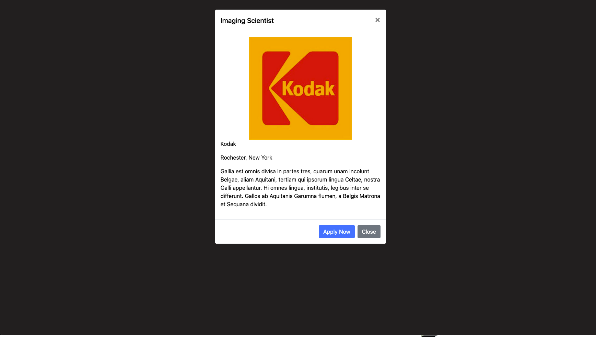
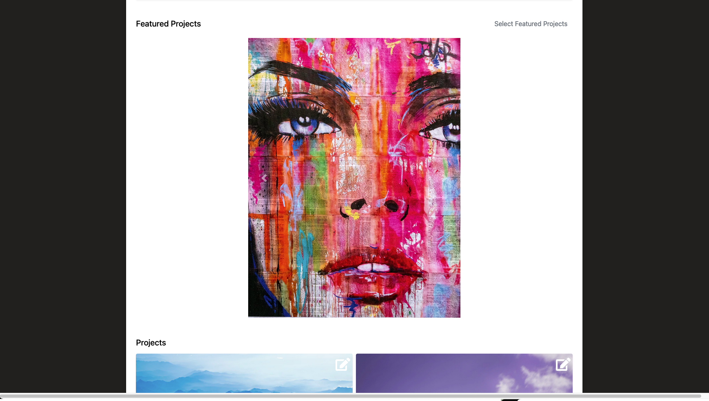
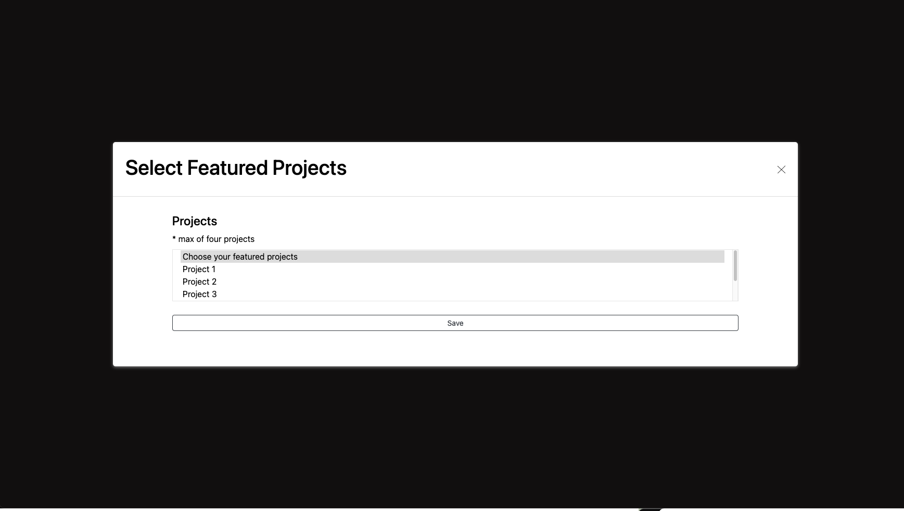
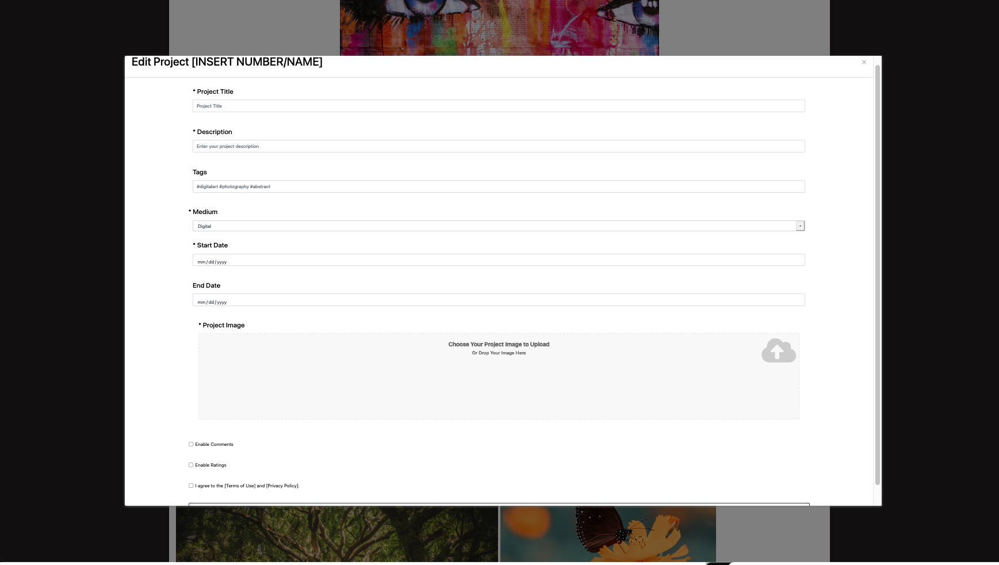
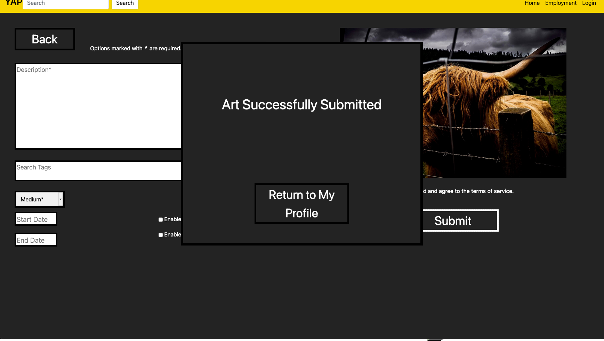

# Yet Another Portfolio - YAP

Team Members: Celeste Gambardella, Brandon Chu, Cole Bleichfeld, Dylan Green, Brendan Grau

## System Concept

YAP (Yet Another Portfolio) is for artists/creators, contractors/employers, and the public. This will allow creators to post their content so that other people including potential employers can view and interact with it. Users will have the ability to like, comment, and commission future and existing work. YAP will connect creators with potential customers be that on a commission basis or for employment purposes. YAP will provide a minimal set of customization options for portfolios, with the main focus being a timeline of projects the creator posts, with interaction options next. YAP will enable users to connect and network with other users and potential employers/contractors. The users will be able to update current projects they are working on overtime. Others will be able to like, comment, and reply to an individual's portfolio post. This will allow people to connect and find others to work for potential employment opportunities.

## Project Structure

The team primarly used the following frameworks in the creation of or beta prototype:

- html5
- css
- js
- bootstrap 4 or greater

As for the structure of our application we decided to focus on the ease of use for our users. Which heavily relied on labeling and taking our color choices into consideration when developing. Our main tasks focus no the artists perspective from the application on the following pages:
- index.html - (Homepage)
- customization.html - (Artist Portfolio)
- submit.html (Art Submission)
- feedback.html - (Feedback Control)
- search.html - (Job Search)

## Features
Clicking on Hank Smith's first artwork will bring you to the ability to control the feedback on that artwork in which a user can see the options they would have over there own artwork. The implementation of deleting, reporting, and replying to comments is not yet implemented.

The Employment option in the navigation will allow artists to search for job opportunities.

The Login option in the navigation will bring the artists to their portfolio page.
Right now this shows an artists perspective of the site and the options they would have to customizae their portfolio. The save button of the options selected are yet to be implemented.

From the artists portfolio page an artist can submit a new artwork at the bottom of the page that will bring you to the Art Submission page in which you can click continue to walkthrough the process of submitting adding a project to your portfolio. The functionality of uploading a file is yet to be implemented.

All other design features and fuctionality of the site is described below.

## Beta Prototype

To see our site prototype up and running you can click on the flowing link:
- [YAP Website](https://cg7346.github.io/YAP/src/)
- [YAP README.md](https://cg7346.github.io/YAP/)

### Homepage

The homepage for YAP contains sets of artwork beneath the names of the users that uploaded them in a timeline fashion. This provides a simplistic overview of each respective portfolio. The user can keep scrolling towards the right in a sort of “carousel” motion, to find others. This is below the standard navigation bar and header, which contains buttons that take you back to the homepage, allow you to search YAP, or log in and go to your profile.

### Employment Search

This is the employment search page. Users will use this page to search for potential employment opportunities. Advanced employment filters are available on the left of the page to narrow down the user’s search. Lightning bolt icons let the user know that that particular job is accepting automatic submission of a portfolio and resume through our “Quick Apply” feature. 

###  Job Employment Details

This is what users see when they click on a Job opportunity in. A popup will appear giving a more detailed description of the opportunity. If the job opportunity has quick apply available, users will be able to click quick apply to automatically submit their portfolio and resume to the company.

###  Job Employment Submisson Confirmation

This is what a user sees when they successfully submit their job application. It is the same screen as, however, it includes a popup notifying them that their material has been automatically submitted to said job.

### Portfolio Customization Page

This is the initial page artists will see when they go to customize their portfolio page. Here they will have the option to change their profile picture through the pencil icon in the top left corner in which they can upload a file through various file management sites: Google Drive, DropBox, or locally stored files on their computer. The pencil icons in each of the various elements let the artists know they can edit the following fields. Meanwhile, the gear icon in the bottom left corner is where the artist can edit the overall portfolio settings including the theme of the portfolio, background color and image, and font style and color. Lastly, the button in the top left corner will allow the user to post new artwork and bring you to that corresponding page.

### Portfolio Header Section Editing

This popup appears when an artist clicks on the edit icon in the top section with the artist's name, specialty, and location. Here artists will be able to edit the name displayed at the top of their portfolio, pick their specialty from a dropdown list, and edit their location. The artist will also be able to upload their resume here that will be used if they use the ‘quick apply’ option to any jobs. They will have to agree to the Terms of Use and Privacy Policy before they can save their edits this way they are liable for any inappropriate content they type of upload. Upon saving their changes they will be brought back to the main customization page.

### Portfolio Selecting Featured Projects

This popup will be displayed when an artist clicks on the edit icon in the featured projects section. Here they will be able to select multiple projects to be featured at the top of their portfolio page. They will be able to select only a maximum of four projects though which is said underneath the project’s label. Once they are done selecting their featured projects they must click save to see the changes made to their portfolio. Upon clicking save the popup is closed and they are brought back to the main customization page.

### Portfolio Editing Projects

This popup is displayed upon an artist clicking on the edit button on a project. They will have the option to edit the title, description, change or edit any tags, the medium, of the project, the start, and end date if applicable, enable or disable comments or ratings, and change the art uploaded. After they agree to the Terms of Use and Privacy Policy they can save the changes they make and be brought back to the main customization page 

### Portfolio Settings Page

This popup is displayed upon an artist clicking on the gear button in the bottom right corner. They will have the option to edit the theme, font style, font color, and background color all from a separate dropdown menu. The artist can also upload a background image they might want to include. After they agree to the Terms of Use and Privacy Policy they can save the changes they make and be brought back to the main customization page.

### Feedback Control

This is the feedback control page. Artist users will use this page to report, hide, or delete comments from a selected artwork. The ellipses are used to present a dropdown menu for the corresponding comment. The large arrows are used to switch between artworks. All visible artworks have some of their comments visible; however, the selected artwork has the most and is presented the largest.

### Art Submission Page

This is the main screen used in an art submission. On the right is a preview of the file they have selected. On the left users will be able to add all relevant information to their art. Required options are title, description, and medium, and will be flagged for the users. The search tags and start and end dates are optional. Additionally, users are able to enable both likes and ratings on the art. Finally, users are able to agree to ToS and submit their art to their YAP profile, this will cause the confirmation popup.

### Art Upload Page

This is the popup that allows users to choose the file they wish to upload. They see this prior to the main submission screen (5.1). The top third can be used to drag and drop files as indicated by the text. In the lower two-thirds are the user's other options. The first opens a window on their computer that allows users to navigate to a file location. The second prompt the user to log into google drive to navigate to a file there. Finally, users can paste in a URL to submit a file directly online. Once a file is selected the user will see the main submission screen (5.1)

### Art Succesfully Submitted Page

This pop-up informs the user that their art was successfully uploaded to YAP. All the user needs to do to finish the art submission process is to click the button to return to their profile.

## Workflow Diagram

The workflow diagram above shows how our various user roles interact with each other. The system consists of our YAP Database and our YAP Web interface. Artists can publish their work on the site so other artists, general users, and employers can view and interact with them. Employers can contact artists to initiate employment negotiations. 

##Affinity Diagram

The WAAD Diagram above was an interesting experience for the team. As expected, we had a few overlapping activity notes that we needed to synthesize into one note. From our work activity notes, we were able to come up with the 5 categories above: Competitors, Employer Artists Interaction, Presentation, Feedback, and Customization. These categories allow us to divide up our requirements and make sure that we are satisfying all aspects of our system. 

## Purpose of Usability Evaluation

The purpose of a usability evaluation of the YAP is to predict the expected performance of the actual customer using the current product and materials, as well as detect any serious problems prior to the release of the product. The features that will be tested through the usability evaluation process are: 

- The automatic submission of portfolios and resume to the options that allow it.
- Searching YAP for employment options 
- The ability to control the feedback on your own posts.
- The ability of artists to customize their portfolios.
- The ability of artists to post new artworks to their portfolio.

## Usability Goals

- Artists will be able to customize their portfolios with a minimum of five colors.
- Artists will be able to customize their portfolios with a minimum of three fonts.
- 90% of users will be able to find and click on an artists portfolio page within 20 seconds.
- 95% of users will be satisfied with their experience with YAP and have a 70% return rate.
- Users will learn and be able to add complex comments to a post within 60 seconds.
- Users will be able to submit their portfolio using ‘Quick Apply’ to an employer within 10 seconds.
- Users will learn how to search for other artists using the different filters within 5 seconds without any assistance.

## Social Model

A system social model diagram that shows the major system nodes and the interactions between them.

## Sample Persona

### Artists

#### Background

	Age: 21
	Occupation: Undergraduate art student
	School: Rochester Institute of Technology, 
	Technology level: Average tech literacy.

#### Attributes

	Third-year art student
	Highly creative
	Comfortable with many artistic mediums.
	Eager to learn new skills and techniques.
	Spends most free time creating art.

#### Goals

	Find employment opportunities
	Tell their story through art
	Connect with like-minded artists
	Find inspiration for their work

## Interface Rational

### Homepage & Navigation Bar

The homepage was intended to be a sort of brief showcase of every profile, with links to a wide variety of content to advertise users, much like an art gallery. We afforded users the ability to know who created each work by separating them by name, and how to use it cognitively by making use of the scrollbars in either direction when necessary, that would be noticed in a desktop browser, or intuitively scrollable on a touch screen. The navigation bar is a common and simple directory of different places users can expect to want to go to and is hence present on every page. Either back to the homepage by clicking on the “YAP” logo, searching portfolios by clicking on the spyglass icon, a commonly-afforded symbol of searching, or going to the employment page (should you be an artist looking for work). There is also a login/account option we opted to put on the navigation bar for quick access, which could be from anywhere.

### Employment Search

For the Employment Search designs, we wanted to focus on ease of use for our users. We used cognitive affordances by carefully labeling buttons and navigation to help the user navigate. For the “Quick Apply” (lightning bolt), something that may not be extremely intuitive, instructions are labeled when a job opportunity card is clicked. Also, the quick apply button is the same color to help them make the association with the lightning bolt. For error prevention, we decided to make job opportunities in a card popup style instead of renavigating the user to a separate job description page. This would reduce the time it would take to navigate back if the user accidentally clicked on the wrong job opportunity.

### Artist Customization

In regards to the artist's customization, we are hoping to minimize the number of clicks and amount of time an artist would have to take to customize their portfolio. In doing so we have edit icons for each of the subtasks on the artists’ portfolio page. We used cognitive affordances by using universal symbols of edit, setting, and info icons. This way the artist will know what options they have just by looking at the page with meaningful labels to help artists if they might be confused with what something might mean. The icons we use also act as a physical affordance as well. By prior experience artists have on other websites we stuck closely to the universal symbols on the customization page. Also, have the general location of the save button is at the bottom of the screen or popup screen lets users know they can click the button. The functional affordance of the dropdown menus explaining what the information adds more functionality behind the idea of the dropdown or have the button be labeled save. The idea we had behind having pop-ups for all the different edit options lets the artists stay on the current page and not have to be redirected onto other pages. While also being able to easily access certain parts of their portfolio to customize quickly.

### Feedback Control

For the feedback control, we wanted an easy way to switch between artworks in chronological order since most use of this feature will be with artworks that were recently published. To do this, we went with arrows to switch between artworks and a small display so that the user could tell what artwork they would be moving to. In terms of the actual functionality of the feature, the ellipsis was chosen to open a menu next to any comment as it is a commonly recognized means of doing this on many other systems. The menu will be displayed as close to the comment as possible to clearly remind the user what comment they are modifying.

### Art Submission

For the art submission, we wanted to help guild the user through the process, to minimize any error, by breaking it down into two distinct steps. First users must choose the file they wish to upload. The drag and drop option gives a physical affordance, allowing the user to drag the file, rather than navigate through files to select it. The labels and order of the options are meant to supply multiple cognitive affordances. Clear labels for each option, followed by the instructions for that method only help the user to quickly understand what to do. Additionally, the options are ordered to help the user. The spot to drop is bigger than the other option and requires a different interaction, as such, it is the top-most option with a unique label on it. Below are the options for navigating to a file on the computer or drive, in that order. The local file is first so that it is closer to the drop option, a similar option.  The two are grouped together as they accomplish the same thing in different places. Finally, the spot to insert a URL is at the bottom and is white to indicate to the user that it is a text file and not a button. 

Once a file is selected the user is able to start on the second step, filling out all the information for the art. Again the layout of this screen aims to help the user understand and interact with it as efficiently as possible. The title, description, and search tags are all large text fields, grouped together and colored white to indicate they require text input. The next option down is the medium drop down, the last of the required fields. The use of a drop-down saves the user from worrying if they are putting in a bad option. The start date and end date will only allow the user to input three 2 digit numbers to prevent them from putting in the wrong date. To the right are checkboxes to enable comments and rating, making their state clear to the user. After this users can verify they have their correct art, can submit their art, only after they agree to the ToS. Once submitted they receive a popup giving a sensory affordance by informing them that it was successful. Their only option at this point is to finish the submission process by returning to their profile, or using one of the navigation buttons at the top.